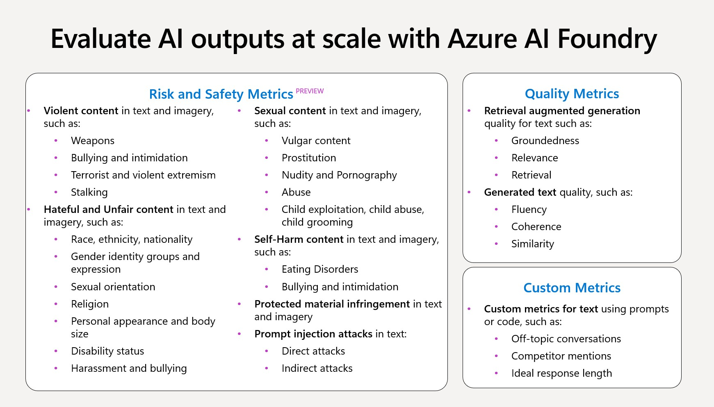

# GenAI Evaluations for Azure AI

A comprehensive evaluation framework for Generative AI responses using Azure AI services, featuring quality metrics, safety assessments, and custom evaluators.


## 🚀 Quick Start

### Prerequisites
- Python 3.8 or higher
- Azure subscription with Azure OpenAI access
- Jupyter Lab or VS Code with Jupyter extension

### Installation

1. **Clone the repository**
   ```bash
   git clone <your-repo-url>
   cd evals
   ```

2. **Create and activate virtual environment**
   ```bash
   python -m venv .venv
   # Windows
   .venv\Scripts\activate
   # macOS/Linux
   source .venv/bin/activate
   ```

3. **Install dependencies**
   ```bash
   pip install -r requirements.txt
   ```

4. **Configure environment variables**
   ```bash
   cp env.sample .env
   # Edit .env with your Azure credentials
   ```

### Running the Evaluation

#### Option 1: Using Jupyter Lab

```bash
# Open in VS Code
code .

# Open genai_evals.ipynb
# Select Python interpreter from .venv
# Run all cells using Ctrl+Shift+P -> "Notebook: Run All"
```

## 📊 Data Format and Mapping

### JSONL Structure
Your evaluation data should be in JSONL format with the following required fields:

```json
{
  "query": "User's question or prompt",
  "context": "Relevant background information from retrieved documents at inference time (can be empty)",
  "response": "AI model's response to evaluate",
  "ground_truth": "Expected or reference response"
}
```

### Field Mapping Configuration
The evaluation framework maps JSONL fields to evaluator inputs:

```python
evaluator_config = {
    "content_safety": {
        "column_mapping": {
            "query": "${data.query}", 
            "response": "${data.response}"
        }
    },
    "relevance": {
        "column_mapping": {
            "response": "${data.response}", 
            "context": "${data.context}", 
            "query": "${data.query}"
        }
    },
    "similarity": {
        "column_mapping": {
            "response": "${data.response}", 
            "ground_truth": "${data.ground_truth}", 
            "query": "${data.query}"
        }
    }
}
```


## 📋 Evaluation Metrics

Below are some of the evaluation metrics released recently. Please continue to follow the Azure AI Foundry documents for recent evaluation announcements.

https://learn.microsoft.com/en-us/azure/ai-foundry/concepts/observability




### Quality Metrics

#### Groundedness
- **Definition**: Ensures responses are based on reliable, factual information
- **Use Case**: Verify AI responses cite accurate sources and facts
- **Example**: "The Eiffel Tower is in Paris, completed in 1889" ✅

#### Coherence
- **Definition**: Assesses logical flow and absence of contradictions
- **Use Case**: Ensure responses maintain consistent reasoning
- **Example**: "The dog ran to chase a squirrel, then returned wagging" ✅

#### Fluency
- **Definition**: Measures grammatical accuracy and natural language flow
- **Use Case**: Evaluate readability and language quality
- **Example**: "We should visit the museum this weekend" ✅

#### Relevance
- **Definition**: Evaluates how well responses match user queries
- **Use Case**: Ensure AI answers the actual question asked
- **Example**: Query about deathly ship accidents → Response about Titanic facts ✅

#### Similarity
- **Definition**: Compares generated response to ground truth reference
- **Use Case**: Measure accuracy against expected answers
- **Example**: Generated vs. reference legal opinions comparison

### Safety & Risk Metrics

#### Content Safety Evaluator
Detects potentially harmful content across multiple categories:

- **Hate and Unfairness**: Discriminatory language based on protected characteristics
- **Sexual Content**: Inappropriate sexual material or harassment
- **Violence**: Content promoting physical harm or threats
- **Self-Harm**: Content encouraging self-injury or suicide
- **Protected Materials**: Potential copyright infringement

#### Custom Evaluators
- **Friendliness**: Measures tone and approachability of responses
- **Professional Tone**: Evaluates business-appropriate communication
- **Legal Compliance**: Assesses adherence to regulatory requirements

## 🔧 Configuration

### Environment Variables (.env)
```bash
# Azure OpenAI Configuration
AZURE_OPENAI_ENDPOINT=https://your-endpoint.openai.azure.com/
AZURE_OPENAI_API_KEY=your-api-key
AZURE_OPENAI_DEPLOYMENT=gpt-4o 
AZURE_OPENAI_API_VERSION=2024-12-01-preview

# Azure AI Project
AZURE_SUBSCRIPTION_ID=your-subscription-id
AZURE_RESOURCE_GROUP=your-resource-group
AZURE_AI_FOUNDRY_PROJECT=your-project-name
```
Note: Use reasoning models like o3-mini, o3 or o4-mini for higher accuracy and reliability for complex nuanced legal scenarios

### Customizing Evaluations

1. **Modify evaluators**: Edit the evaluators list in `genai_evals.ipynb`
2. **Custom evaluators**: See `friendliness/` folder for examples
3. **Data sources**: Replace `data_3.jsonl` with your dataset
4. **Column mapping**: Update `evaluator_config` for different data schemas

## 📁 Project Structure

```
evals/
├── genai_evals.ipynb          # Main evaluation notebook
├── model_endpoint.py          # Azure OpenAI endpoint wrapper
├── requirements.txt           # Python dependencies
├── env.sample                 # Environment template
├── .env                       # Your credentials (not in repo)
├── data/
│   └── data_3.jsonl          # Evaluation dataset
├── friendliness/             # Custom evaluator example
│   ├── friendliness.prompty  # Prompty template
│   └── friendliness.py       # Evaluator implementation
├── results.csv               # Generated evaluation results
├── results.jsonl             # Raw evaluation output
└── images/                   # Documentation assets
```

## 📈 Results and Output

### Generated Files
- **`results.jsonl`**: Raw evaluation results in JSONL format
- **`results.csv`**: Formatted results for analysis and reporting
- **Evaluation dashboard**: Available in Azure AI Foundry portal

### Interpreting Results
Each evaluation produces scores typically ranging from 1-5 or 0-1:
- **Higher scores**: Better performance
- **Content Safety**: Binary pass/fail with confidence scores
- **Custom metrics**: Domain-specific scoring criteria

### Sample Results Structure
```json
{
  "query": "Original question",
  "response": "AI response",
  "coherence_score": 4.2,
  "relevance_score": 4.8,
  "content_safety_score": "Safe",
  "friendliness_score": 4.5
}
```

## 🏢 Business Use Cases

- **Legal Compliance**: Evaluate AI responses for regulatory adherence
- **Quality Assurance**: Ensure consistent, professional communication
- **Content Safety**: Prevent harmful or inappropriate responses
- **Customer Experience**: Optimize AI interactions for user satisfaction
- **Regulatory Reporting**: Generate compliance documentation

## 🔍 Troubleshooting

### Common Issues

1. **Authentication Errors**
   - Verify `.env` file exists and contains valid credentials
   - Check Azure subscription permissions

2. **Missing Dependencies**
   - Run `pip install -r requirements.txt`
   - Ensure virtual environment is activated

3. **Data Format Errors**
   - Validate JSONL structure matches expected schema
   - Check for missing required fields (query, response, etc.)

4. **Evaluation Failures**
   - Review Azure AI project configuration
   - Verify model deployment names and regions

### Getting Help
- Check Azure AI Foundry documentation
- Review evaluation logs in notebook output
- Verify data format against examples

## 📄 License

This project is licensed under the MIT License - see the [LICENSE](LICENSE) file for details.

## 🤝 Contributing

1. Fork the repository
2. Create a feature branch
3. Make your changes
4. Add tests and documentation
5. Submit a pull request

---

*For additional support or questions, please refer to the Azure AI documentation or create an issue in this repository.*

## Business Use Cases

- **Quality Assurance**: Verify that AI-generated responses meet business standards.  
- **Compliance**: Ensure all responses follow regulatory and ethical guidelines.  
- **Customer Engagement**: Enhance customer experience by analyzing and improving AI interactions.

For further details, refer to the inline documentation within the notebooks.

